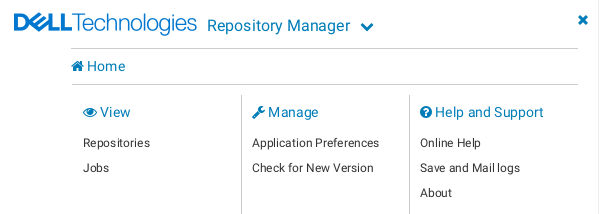

# Download Repositories with Dell Repository Manager

You can run Dell Repository Manager on a server separate from Patches however, these instructions were written with the assumption they are on the same Rocky Linux host.

1. Download Dell Repository Manager (DRM) from [this webpage](https://www.dell.com/support/home/en-us/drivers/DriversDetails?driverid=8GDHG).
2. Select the file with file format name *Linux Binary File*.
3. On Rocky Linux, you will need to install tar with `sudo dnf install -y tar`
4. If you installed the minimal version of Rocky Linux you will need a GUI for DRM. You can install the GUI with `dnf group install -y "Server with GUI"`. After the installation finishes, you will need to change your default target to graphical with `systemctl set-default graphical` and then reboot with `sudo reboot`. If you already have a GUI you can skip this.
   1. Once the system reboots it should start with a GUI and then you can log in as a user. Do not login as root.
5. Next run the installer with `sudo bash DRMInstaller_<VERSION>.bin`
   1. If you do not run the installer with the sudo the installation will fail
6. When asked where you want to place shortcut links I suggest you select option 3 and then place the shortcuts in your home directory like this:

        ===============================================================================
        Choose Link Location
        --------------------

        Where would you like to create links?

          ->1- Default: /root
            2- In your home folder
            3- Choose another location...

            4- Don't create links

        ENTER THE NUMBER OF AN OPTION ABOVE, OR PRESS <ENTER> TO ACCEPT THE DEFAULT
              : 3
        ENTER THE ABSOLUTE PATH TO THE SHORTCUT DIRECTORY
              : /home/grant/Desktop

7. Before continuing, you will need to give the DRM user `drmuser` access to the repos folder for patches. Do this by going to the patches folder and running `sudo chown -R drmuser: drm_repos`. Next set the permissions on the folder correctly with `sudo chmod 755 -R drm_repos`
8. For me, the icon did not correctly appear on the desktop. You can run DRM from the command prompt **as user** with `/opt/dell/dellrepositorymanager/drm.sh`. **Do not run DRM as root**.
9. Next you need to create a repository
   1. In the top left create *Add Repository*
   2. Create a *Repository Name* and *Description* of your choosing
   3. Leave *Base Catalog* as Enterprise Server Catalog
   4. Under *Select Systems* you can either do all systems or some subset of systems of your choosing.
   5. Under *Operating Systems* you can either pick specific operating systems or all. **NOTE**: the  iDRAC only accepts exe files. If you plan on pushing updates to the iDRAC make sure you select *Windows-64*
   6. For *Components* you may either download all of them or select specific components.
10. Next, you will need to download the repository data. In the top bar click the *Download* button. Select the `<your_patches_directory>/drm_repos/drm_download` folder.
    1.  **WARNING**: DRM downloader is persnickety. You **must** select a bottom-level directory (IE: there are no other subdirectories in the folder) for it to work. `drmuser` must also be the owner of the bottom level directory **and** the parent directory. Anything else will result in DRM complaining about an invalid directory.
    2.  **WARNING**: I suggest typing in the path to the directory directly rather than using the browser. If at any point in the folder path DRM does not have permissions it will complain and error. It is easiest to direct it with the absolute path.
11. After you start the download, you can monitor the progress of the download in the jobs tab by clicking on *Repository Manager* at the top and then *Jobs*

12. Next, you will need to export the repository. Select your repository's checkbox and then click *Export*. Select the `<your_patches_directory>/drm_repos/drm_export` folder.
    1.  **NOTE**: You can monitor the progress of the export in the Jobs tab as you did with the download.
13. When you have finished downloading the repository, move it to a location of your choosing on your Patches server, and then run `bash <your_patches_directory>/podman-build/patches.sh import-repository` and follow the prompts
14. For any other repositories you want to create repeat the process of downloading the repository, exporting it, and then move it to a new folder **with the correct permissions** (this is key) in the `<your_patches_directory>/repos/xml` folder. For example, if I were going to add a new repo with all PowerEdge servers, I could create the repo in DRM, export it, and then move it to a new folder `<your_patches_directory>/repos/xml/PowerEdge`. 
