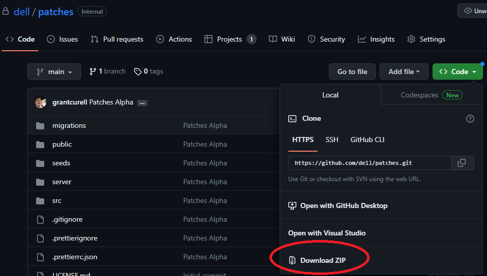

# Patches

This code is currently under active development. The project is in a beta phase. If you would like to try the beta code please use the [beta branch](https://github.com/dell/patches/tree/beta). 

## What Is Patches?

Patches is an offline repository with a web frontend that hosts all of Dell's PowerEdge patches. Its primary purpose is to provide the ability to host PowerEdge patches in offline environments. The web frontend is a rough mock-up of Dell's support website. It allows users to search, view, and download available Patches. It also provides a web server for integration into Dell's OpenManage Enterprise.

Patches uses certificates for authentication and it requires any connecting users to present a valid certificate to access the site.

It also provides an admin panel which tracks download and usage statistics from the web UI.

**Beta**: In the full release we will add the ability to disable cert checking but for the beta it is force enabled. Patches is primarily designed to integrate into an existing PKI infrastructure.

## Supported Operating Systems

Patches can be run on any *nix system that supports `podman` but all testing was done on and the instructions written for [Rocky Linux](https://rockylinux.org/) and we strongly suggest this be the operating system of choice for Patches.

Last tested version was Rocky Linux 9.2.

Any RHEL-based system should work out of the box. Please post an issue if you encounter issues.

### What is Rocky Linux and Where Can I Get It

Rocky Linux is the spiritual successor to previous iterations of CentOS. It is available [here](https://rockylinux.org/).

We recommend you use the Minimal distribution.

## System Requirements

Patches can run on a shoestring server, but the installer will check to make sure you have at least 80GBs of free space during the installation. Note: This is not to say that the hard drive should be 80GBs, there must be 80GBs of free space at runtime.

## Patches Architecture Overview

Patches consists of the following Podman containers:

TODO - clarify for less experienced

- A NodeJS backend for handling all queries
- A ReactJS frontend for displaying the frontend
- An instance of Nginx which proxies connections from users to either the ReactJS frontend server or the backend server dependent on the URI requested
- Postgresql stores all metadata for the various patches along with the user statistics of who used what Patches
- An HTTPD container which hosts the raw Dell Repository Manager repos which OME can leverage

## Installation

### Download Patches

#### Using Command Line

Not available during the beta because the repos are currently private.

#### Using Browser

1. Go to [Dell's GitHub Page](https://github.com/dell/patches)
2. Click the green *Code* button and then click *Download Zip*

1. Extract the zip in a location of your choosing. Patches will install to this location so make sure it is in the desired install location.
2. If your Linux instance does not have a web UI you can use [WinSCP](https://winscp.net/eng/index.php) to upload the files from your desktop to the Linux server. Linux desktops also have a [built in SCP client](https://www.geeksforgeeks.org/scp-command-in-linux-with-examples/)
3. After you place the files on your Linux server make sure they are owned by you with `sudo chown -R $(whoami) /path/to/patches`

### Install Podman

Run `sudo dnf update -y && sudo dnf install -y podman` and then reboot with `sudo reboot`. The reboot just makes avoiding permissions / kernel issues easy because that information is reread on boot.

Run `podman run hello-world` as your user to test your privileges. If this does not run correctly, Patches will not run correctly.

**WARNING**: If you are SSH'ing to your server, make sure you ssh as a user and **not** root. If you SSH as root and then `su` to user, podman will issue `ERRO[0000] XDG_RUNTIME_DIR directory "/run/user/0" is not owned by the current user`. This happens because the user that originally setup `/run` is root rather than your user.

### Open Ports

At a minimum port 443 and 8080 must be open on the server. We recommend opening 80 and 443 so that users who inadvertently go to 80 are redirected automatically to 443. On Rocky Linux/RHEL this is done with `sudo firewall-cmd --zone=public --add-port=80/tcp --add-port=443/tcp --add-port=8080/tcp --permanent && sudo firewall-cmd --reload`

## Before You Run Setup

### Integrating Into Existing PKI Infrastructure

**Only applicable if you plan on using your own certificates/keys**

Patches has its own certs that it generates and uses with its own internal PKI infrastructure. Required certs:

You will need two PEM files. The first must include at least the root CA's certificate. The second must include the certificate and private key for the patches server itself.

Examples of the certificates are in [rootca.txt](./images/rootca.txt) and [patches.txt](./images/patches.txt)

**Beta Instructions**

An automated import is under development to include the ability to automatically convert from PKCS#12 however during the beta you will need to manually import the certs.

1. Make sure your certificates are in PEM format
2. Make sure the name of the root CA pem file is the same as what is listed in [config.yml](./podman-build/config.yml). The common name in the certificate itself must also match what is in config.yml. For example, if ROOT_CA_NAME is rootCA than your pem file should be rootCA.pem and the common name should be rootCA.
3. Make sure the name of the patches server pem file is the same as what is listed in [config.yml](./podman-build/config.yml). For the patches server, the common name in the cert **must** include the domain. For example, if SERVER_NAME in config.yml is patches and DOMAIN is set to lan then the common name should be patches.lan. This is a bug and is on the list of things to fix in the beta. See [the bug tracker](https://github.com/orgs/dell/projects/8/views/1?pane=issue&itemId=30214314). This will be fixed in the release so that the domain name is not required.
4. Copy your root CA cert to `./server_certs/root_certs`
5. Copy your server cert to `./server_certs`

### Customizing Setup

The file [config.yml](./podman-build/config.yml) controls all installation/setup settings. You can leave the defaults but we recommend you browse through the settings.

Anything outside of the Developer Options are meant for user configuration.

#### Users

If you **are not** using your own certificates, Patches provides a built in Certificate Authority (CA) which allows users to generate their own user certificates. The certificate properties are enumerated in the section clients of [config.yml](./podman-build/config.yml). If you are not using an existing CA, you will need to update these fields with your user data.

One of these users should have a name that matches the name selected for PATCHES_ADMINISTRATOR.

## Running Setup

Log into your Linux server and browse to the `patches/podman-build` directory. Run `bash patches.sh setup` and follow the onscreen prompts.

It's that simple. After the setup completes patches will be up, running, and available.

### Setting Up Certs

If you used Patches to generate user certificates, you will need to download the correct certs and add them to your browser to connect to Patches.

If you used Patches to setup your certs, they will all be in the folder `<your_path_to_patches>/server_certs`.

1. Download the `<your_path_to_patches>/server_certs` to your desktop. If you are running Windows you can do this with [WinSCP](https://winscp.net/eng/index.php).
2. We have tested with Brave Browser, Chrome, and Firefox. All three use the PKCS#12 format for user certs. Begin by going to your browser settings.

3. Go to Privacy and security (or equivalent depending on the browser). And then click Security.

4. Click Manage device certificates

5. You will need to load two certificates here. The first is the root CA certificate. This is in the `<path_to_patches>/server_certs/root_certs` folder. At the top of the window click Trusted Root Certification Authorities

6. Next click Import. Follow the prompts. For file, select the `root_certs/<your_root_CA>.crt` and add it to your certificate store. You can place it in the default store and say yes when prompted if you are sure.
7. Finally, you want to import the user cert for the user in question. Go to the Personal tab and click import.

8. Import the user's PKCS#12 file (.p12 extension). You will need to change the filetype in the dropdown menu here. Leave the password box empty unless you added a password. You can place the certificates in your personal store.

9.  After you are finished your screen should look like this:

10. Next browse to the Patches IP/hostname. You should see a window pop up like this one:

11. If everything has worked up to this point, you should connect to Patches and see that the connection is secure like this:

## Admin Panel

The admin panel is available to the user configured as PATCHES_ADMINISTRATOR. You can also add additional admin users with `bash <path_to_patches>/podman-build/patches.sh add-admin <username>`

## OpenManage Enterprise (OME)

1. Get the OpenManage Enterprise VM from [here](https://www.dell.com/support/kbdoc/en-us/000175879/support-for-openmanage-enterprise#OME-Download)
2. Installation instructions can be found [here](https://www.dell.com/support/home/en-us/product-support/product/dell-openmanage-enterprise/docs)
3. After you have finished installing and deploying OME, go to Configuration->Firmware/Driver Compliance

4. Catalog Management

5. Add the catalog

6. Setup your catalog details and run the test

7. Once you have added the catalog, return to Firmware/Driver Compliance and click Create Baseline. In the popup window select the catalog you just created as the catalog. Follow the prompts to finish adding the baseline.

8. After you add the baseline it will automatically run, but you can also check compliance by clicking the check box next to the baseline and selecting check compliance

## How We Version

### Major Version

This is incremented when we make changes that are not compatible with previous versions, such as significant API changes or the introduction of major new features. Updating the MAJOR version indicates that users may need to modify their code or adjust their integrations to work with the new version.

### Minor Version

This is incremented when we add new functionality to the software in a way that is backward-compatible. It signifies the introduction of new features or enhancements that users can take advantage of without needing to make any changes to their existing code or integrations.

### Patch Version

This is incremented when we make bug fixes or address issues in a backward-compatible manner. It indicates that the software has undergone improvements or fixes, ensuring a more stable and reliable experience for users. Updating the PATCH version does not introduce any new features or require modifications to existing code.

## Debugging

See [DEBUGGING.md](./DEBUGGING.md)
